# Golang全自动亚马逊全网分布式爬虫（美国，日本，德国和英国）

## 2017.04.06

爬虫包升级， 亚马逊爬虫仍然能跑！！！依赖[https://www.github.com/hunterhug/GoSpider](https://www.github.com/hunterhug/GoSpider)

网站端见：Web is GoAmazonWeb See [https://github.com/hunterhug/AmazonBigSpiderWeb](https://github.com/hunterhug/AmazonBigSpiderWeb)


英文已经凌乱，仔细阅读，有益身心，中文见[中文版说明](china.md)

# Distributed GoAmazon Spider
Ad API Go to [http://affiliate-program.amazon.com/](http://affiliate-program.amazon.com/)

Web is GoAmazonWeb See [https://github.com/hunterhug/AmazonBigSpiderWeb](https://github.com/hunterhug/AmazonBigSpiderWeb)

Support UAS/Japan/Germany/UK, Amazing!

1. USA done!
2. Japan done！
3. Germany done!
4. UK done!

And Japan will change some code, attention!

## Introduction

Catch the best seller items in Amazon USA! Using redis to store proxy ip and the category url. First fetch items list and then collect 
many Asin, store in mysql. Items list catch just for the Asin, and we suggest one month or several weeks to fetch list page. We just need fetch the Asin
detail page and everything we get!

We keep all Asin in one big table. And if catch detail 404, we set it as not valid. Also we can use API catch big rank but look not so good!

So, there are two ways to get the big rank

1.catch list page(not proxy), using API get the big rank

2.catch list page(not proxy), and then get asin detail page(proxy), API can not catch all the asin big rank so must use this!

Due to we want list smallrank and the bigrank at the same time, but mysql update is so slow, we make two tables to save, one is smallrank, one is bigrank!

We want rank by those Asin:

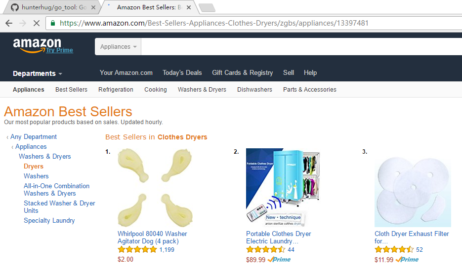

Data we want:


# How to use

We need **Redis** and **Mysql** and some develop environment, Such as Proxy IP Machine. So can learn by [http://www.cjhug.me/code/centos7.html](http://www.cjhug.me/code/centos7.html)

Got it!

```bash
    go get -v -u github.com/hunterhug/AmazonBigSpider
```

run it like that

```bash
#!/bin/sh
nohup go run  *.go > ip.txt 2>&1 &
```

make a config and read the code!

```bash
go run ippool.go  ( sent ip to redis pool  proxy can use)
go run urlpool.go  (send category url to redis pool the list url we want to catch)
go run listmain.go ( catch the list page and keep local,20161111!)
go run asinpool.go ( sent asin url to redis pool we want to catch)
go run asinmain.go( catch asin detail page!one table asin20161111 and others is A?!)
```

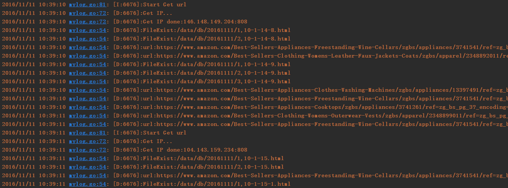

## Design

One picture is more than a lot of words!

<div style="text-align:center">
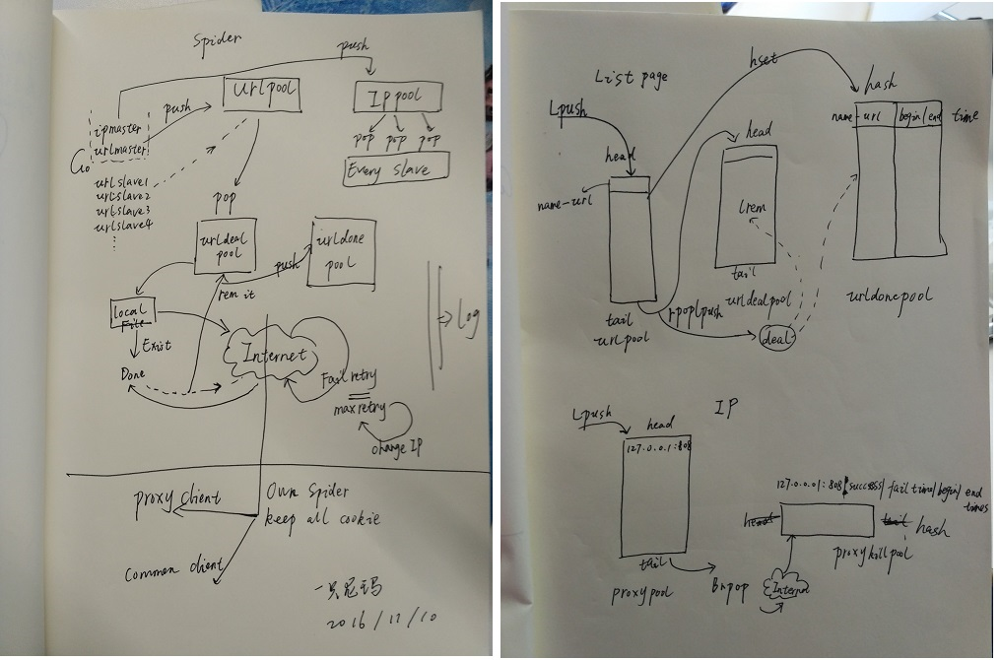
</div>

Redis Data like that:

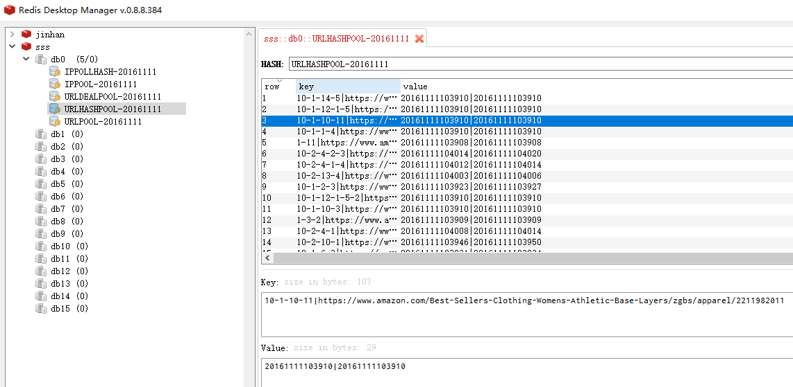

And URL fetch like this, url many be repeat:

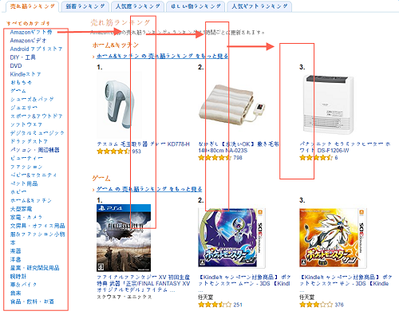

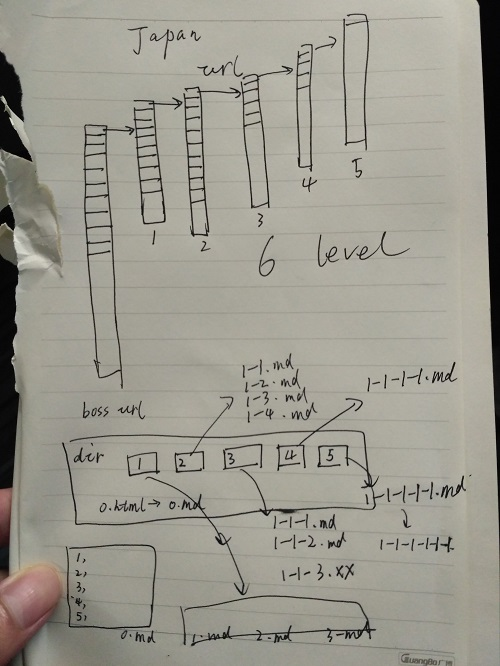

Final Url data:

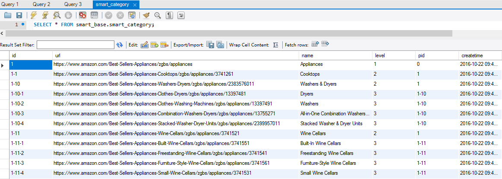

## SQL

As sql:

```sql
--- smart_base
--- category
CREATE TABLE `smart_category` (
  `id` varchar(100) NOT NULL,
  `url` varchar(255) DEFAULT NULL COMMENT '类目链接',
  `name` varchar(255) DEFAULT NULL COMMENT '类目名字',
  `level` tinyint(4) DEFAULT NULL COMMENT '类目级别',
  `pid` varchar(100) DEFAULT NULL COMMENT '父类id',
  `createtime` datetime DEFAULT NULL COMMENT '创建时间',
  `updatetime` datetime DEFAULT NULL COMMENT '更新时间',
  `isvalid` tinyint(4) DEFAULT '0' COMMENT '是否有效',
  `page` tinyint(4) DEFAULT '5' COMMENT '抓取页数',
  `database` varchar(255) DEFAULT NULL COMMENT '存储数据库',
  `col1` varchar(255) DEFAULT NULL COMMENT '预留字段',
  `col2` varchar(255) DEFAULT NULL,
  `col3` varchar(255) DEFAULT NULL,
  `bigpname` varchar(255) DEFAULT NULL COMMENT '大类名字',
  `bigpid` varchar(100) DEFAULT NULL COMMENT '大类ID',
  `ismall` tinyint(4) DEFAULT '0' COMMENT '是否最小类',
  PRIMARY KEY (`id`),
  UNIQUE KEY `url_UNIQUE` (`url`)
) ENGINE=InnoDB DEFAULT CHARSET=utf8 COMMENT='类目';


--- ASIN Collect
CREATE TABLE `smart_asin` (
  `id` varchar(100) NOT NULL,
  `createtime` varchar(255) DEFAULT NULL COMMENT '添加时间',
  `updatetime` varchar(255) DEFAULT NULL COMMENT '更新时间',
  `category` varchar(255) DEFAULT NULL COMMENT "which category",
  `times` int(11) DEFAULT '0' COMMENT '重复次数',
  `isvalid` tinyint(4) DEFAULT '1' COMMENT "valid",
  PRIMARY KEY (`id`)
) ENGINE=InnoDB  DEFAULT CHARSET=utf8 COMMENT='Asin Big Data';

--- Big rank by asin!
  CREATE TABLE `A1` (
  `id` varchar(150) NOT NULL,
  `day` varchar(150) NOT NULL,
  `bigname` varchar(255) DEFAULT NULL COMMENT '大类名',
  `title` TEXT COMMENT '商品标题',
  `rank` int(11) DEFAULT NULL COMMENT '大类排名',
  `price` float DEFAULT NULL,
  `sold` varchar(255) DEFAULT NULL COMMENT '自营',
  `ship` varchar(255) DEFAULT NULL COMMENT 'FBA',
  `score` float DEFAULT NULL COMMENT '打分',
  `reviews` int(11) DEFAULT NULL COMMENT '评论数',
  `createtime` varchar(255) DEFAULT NULL,
  `img` varchar(255) DEFAULT NULL,
  PRIMARY KEY (`id`,`day`)
) ENGINE=InnoDB DEFAULT CHARSET=utf8mb4;


--- smartdb
--- Smallrank by date!
CREATE TABLE `20161028` (
  `id` VARCHAR(150),
  `purl` varchar(255) DEFAULT NULL COMMENT '父类类目链接',
  `col1` varchar(255) DEFAULT NULL COMMENT '预留字段',
  `col2` varchar(255) DEFAULT NULL,
  `img` varchar(255) DEFAULT NULL,
  `iscatch` tinyint(4) DEFAULT '0' COMMENT '已抓取是1',
  `smallrank` INT NULL COMMENT '小类排名',
  `name` VARCHAR(255) NULL COMMENT '小类名',
  `bigname` VARCHAR(255) NULL COMMENT '大类名',
  `rbigname` VARCHAR(255) NULL COMMENT '实际大类名',
  `title` TEXT NULL COMMENT '商品标题',
  `asin` VARCHAR(255) NULL,
  `url` VARCHAR(255) NULL,
  `rank` INT NULL COMMENT '大类排名',
  `soldby` VARCHAR(255) NULL COMMENT '卖家',
  `shipby` VARCHAR(255) NULL COMMENT '物流',
  `price` VARCHAR(255) NULL COMMENT '价格',
  `score` FLOAT NULL COMMENT '打分',
  `reviews` INT NULL COMMENT '评论数',
  `commenttime` VARCHAR(255) NULL COMMENT '第一条评论时间',
  `createtime` VARCHAR(255) NULL,
  `updatetime` VARCHAR(255) NULL,
  PRIMARY KEY (`id`))ENGINE=InnoDB DEFAULT CHARSET=utf8mb4;


--- Big rank by date!
  CREATE TABLE `Asin20161028` (
  id VARCHAR(150),
  bigname VARCHAR(255) NULL COMMENT '大类名',
  title TEXT NULL COMMENT '商品标题',
  rank INT NULL COMMENT '大类排名',
  price FLOAT NULL,
  sold VARCHAR(255) NULL COMMENT '自营',
  ship VARCHAR(255) NULL COMMENT 'FBA',
  score FLOAT NULL COMMENT '打分',
  reviews INT NULL COMMENT '评论数',
  createtime VARCHAR(255) NULL,
  img VARCHAR(255) NULL,
  PRIMARY KEY (`id`))ENGINE=InnoDB DEFAULT CHARSET=utf8mb4;
```

add the connections of mysql:

```
show variables like '%max_connections%';
set global max_connections=2000
```

##  Anti robot

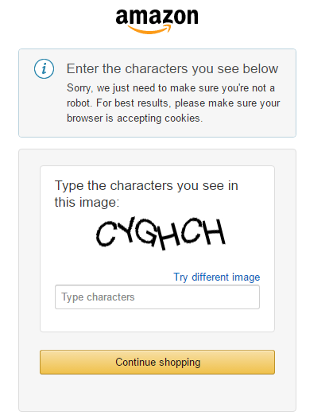

We test a lot,if a ip no stop and more than 500 times http get,the list page will no robot,but the detail asin page will be robot.
So we bind a proxy ip with and fix useragent, and keep all cookie. But it still happen, a IP die still can fetch detail page after 26-100times get,
It tell us we can still ignore robot, and catch max 100 times we will get that page. robot page is about 7KB.

However, if a lot of request, will be like that 500 error, hahaha

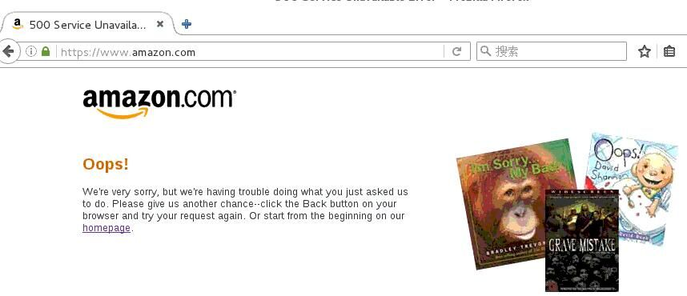

Then if robot you get the picture, will be dead!!! dangeous!


Anti robot is change IP, keep all cookie. Japan List page is anti-robot but USA not!

## Cost

For reason that the detail page is such large that waste a lot of disk space, we save the list page in the local file and the detail page you can
decide whether to save it or not.

following is the cost of time and store

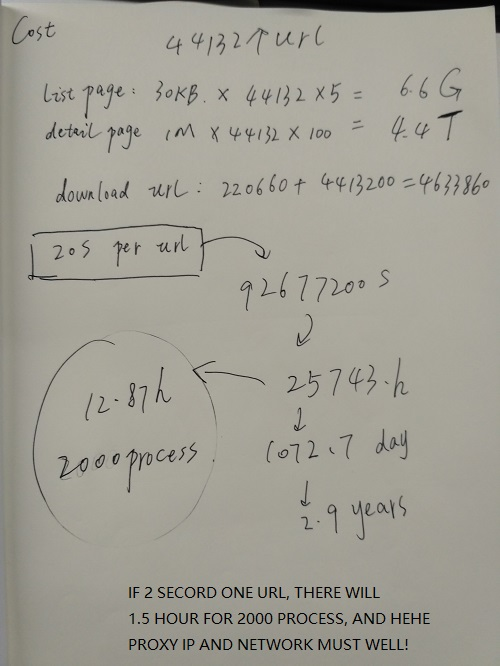


## Question

Another python version:https://github.com/skypika/smartdo, I suppose not to use!

EveryQuestion you can Email me gdccmcm14@live.com or 569929309@qq.com to contact me, 

# Design

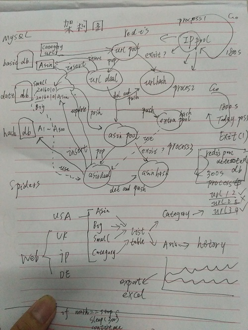


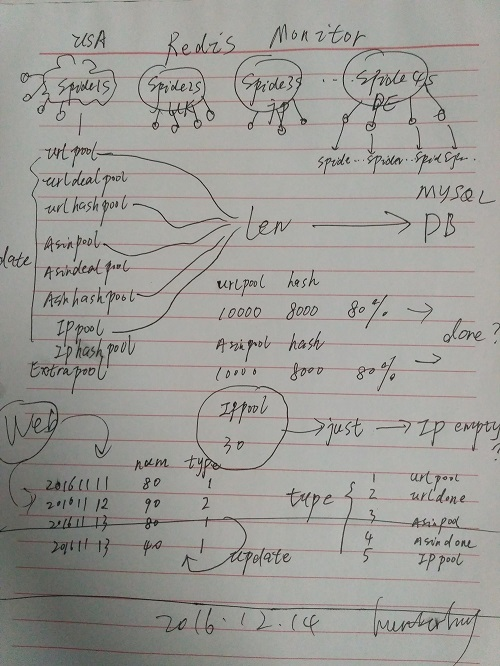


# USE

```
go get -u -v github.com/hunterhug/AmazonBigSpider
go run initsql.go
source /data/www/web/go/src/github.com/hunterhug/AmazonBigSpider/doc/sql/uk_category.sql
```

# Result

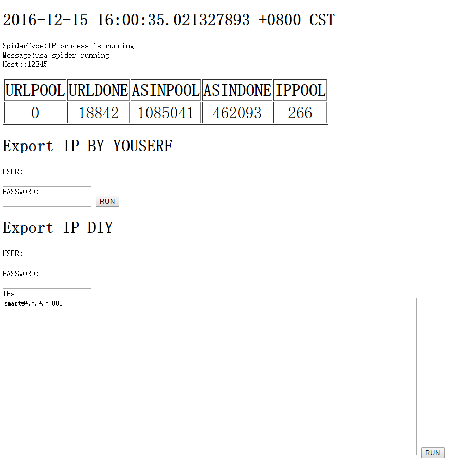

# ERROR
1.Redis

q1:

```
MISCONF Redis is configured to save RDB snapshots, but is currently not able to persist on disk. 
Commands that may modify the data set are disabled. Please check Redis logs for details about the error.
panic: REDIS ERROR

```

solve it

```
redis command
config set stop-writes-on-bgsave-error no
```

q2:

```
redis: connection pool timeout
```

solve it

```
config/config.json set 

"Redispoolsize":2000
```

2.Mysql

q1:

```
mysql error:Error 1016: Can't open file: './uk_smart_base/A296.frm' (errno: 24 - Too many open files)
```

solve it

```
mysql command
SHOW VARIABLES LIKE 'open_files_limit';
SHOW GLOBAL STATUS LIKE 'Open_files';

edit my.cnf

[mysqld]
open_files_limit = 65535

vim /etc/systemd/system/mysql.service
add  LimitNOFILE=65535

systemctl daemon-reload
service mysqld restart

vim /etc/security/limits.conf,add
 
*  soft    nofile  65536
*  hard    nofile  65536

ulimit -n
```

q2:

```
mysql error:Error 1040: Too many connections
show variables like '%max_connect%';
```

solve it

```
SHOW VARIABLES like 'max_%';

set GLOBAL max_connections=5000
```

or

```
[mysqld]
max_connections=15000
```

q3

```
DNS skip
[mysqld]
skip-name-resolve
```

q4

Cannot assign requested address

```
netstat -n | awk '/^tcp/ {++state[$NF]} END {for(key in state) 
print key,"\t",state[key]}'

sysctl net.ipv4.ip_local_port_range

1. 调低端口释放后的等待时间，默认为60s，修改为15~30s
sysctl -w net.ipv4.tcp_fin_timeout=30
2. 修改tcp/ip协议配置， 通过配置/proc/sys/net/ipv4/tcp_tw_resue, 默认为0，修改为1，释放TIME_WAIT端口给新连接使用
sysctl -w net.ipv4.tcp_timestamps=1
3. 修改tcp/ip协议配置，快速回收socket资源，默认为0，修改为1
sysctl -w net.ipv4.tcp_tw_recycle=1

sysctl net.ipv4.ip_local_port_range="32768    62000"
sysctl -w net.ipv4.tcp_fin_timeout=30
sysctl -w net.ipv4.tcp_timestamps=1
sysctl -w net.ipv4.tcp_tw_recycle=1
```

total

```
max_connections = 15000
max_connect_errors = 6000
open_files_limit = 65535
table_open_cache = 1000
skip-name-resolve
```